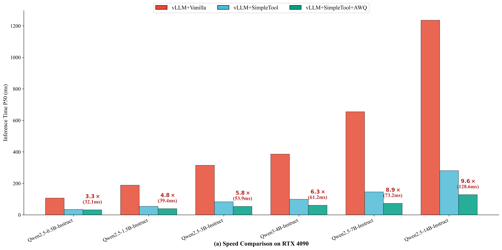
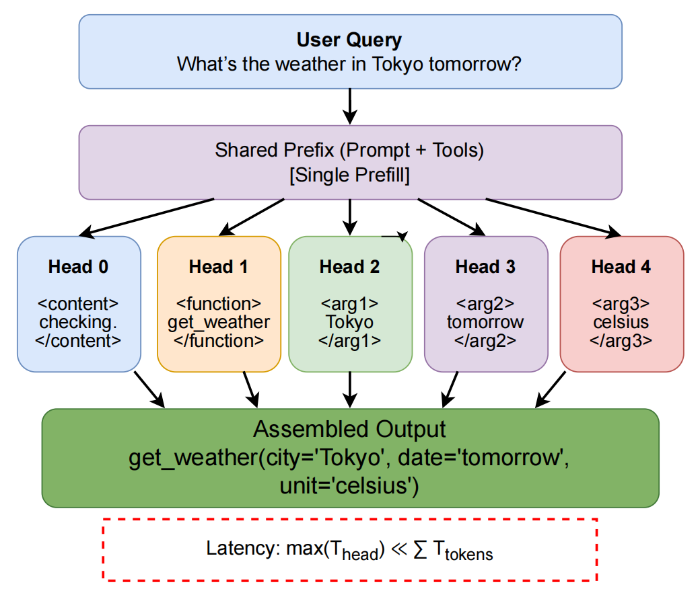

<p align="center">
  <a href="README.md">English</a> | <a href="README_zh.md">中文</a>
</p>
<h1 align="center">SimpleTool</h1>

<p align="center">
  <b>Parallel Decoding for Real-Time LLM Function Calling</b>
</p>

<h2 align="center">ICML 2026 Accepted Paper</h2>

<p align="center">
  <a href="https://arxiv.org/abs/2603.00030"><b>Paper</b></a> ·
  <a href="assets/realtimetool_icml2026_poster.pdf"><b>ICML Poster</b></a>
</p>

<p align="center">
  <a href="https://arxiv.org/abs/2603.00030"></a>
  <a href="https://icml.cc/Conferences/2026"></a>
  <a href="assets/realtimetool_icml2026_poster.pdf"></a>
  <a href="https://huggingface.co/Cialtion/SimpleTool"></a>
  <a href="https://www.modelscope.cn/models/cialtion/SimpleTool"></a>
  <a href="#demo-videos"></a>
  <a href="#demo-videos"></a>
  <a href="#license"></a>
</p>

<p align="center">
  A 4B-parameter LLM achieving <b>16 Hz end-to-end real-time function calling</b> — fast enough to drive game AI, robotic arms, and digital humans.
</p>

<p align="center">
  <b>News:</b> Accepted to <b>ICML 2026</b> as <i>RealtimeTool: Parallel Decoding for Real-Time LLM Function Calling</i>. This repository hosts the SimpleTool/RealtimeTool open-source implementation, models, demos, and <a href="assets/realtimetool_icml2026_poster.pdf">ICML poster</a>.
</p>

---

SimpleTool enables **real-time LLM function calling** through multi-head parallel decoding. By introducing special tokens that compress redundant structured output (4–6×) and enable independent generation of function name and arguments, we achieve **3–6× end-to-end speedup** while maintaining competitive accuracy across three application domains: **games**, **robotic control**, and **digital human animation**.

<p align="center">
  
</p>

## How It Works

Traditional function calling generates tokens sequentially — `function → arg1 → arg2 → ...` — so latency scales linearly with output length. SimpleTool exploits two key observations:

1. **Token Redundancy**: Structured outputs contain predictable tokens (brackets, parameter names, quotes) that can be compressed into single special tokens.
2. **Weak Causal Dependencies**: Function arguments are largely independent of each other and can be generated in parallel.

<p align="center">
  
</p>

By decoding function name and arguments as parallel streams sharing the same prefix KV cache, latency drops from `sum(all_token_times)` to `max(per_head_time)`. The parallel heads utilize idle compute capacity within the memory-bandwidth-bound decode phase, making parallelization nearly free.

For more details, see our [arXiv paper](https://arxiv.org/abs/2603.00030) and [ICML 2026 poster](assets/realtimetool_icml2026_poster.pdf). The camera-ready paper is titled **RealtimeTool: Parallel Decoding for Real-Time LLM Function Calling** and has been accepted to **ICML 2026**.

---

## Quick Start

### 1. Setup Environment

```bash
git clone https://github.com/HaxxorCialtion/SimpleTool.git
cd SimpleTool
```

**Option A — uv (recommended)**
```bash
uv venv env_rt -p python3.12
source env_rt/bin/activate
uv pip install -r requirements.txt
```

**Option B — conda**
```bash
conda create -n simpletool python=3.12 -y
conda activate simpletool
pip install -r requirements.txt
```

**Option C — pip**
```bash
python3.12 -m venv env_rt
source env_rt/bin/activate
pip install -r requirements.txt
```

### 2. Download Model

The recommended default model is **RT-Qwen3-4B-AWQ-v2** (4B parameters, AWQ W4A16 quantized, v2 prompt format). All scripts default to `./models/RT-Qwen3-4B-AWQ-v2`.

```bash
# HuggingFace
huggingface-cli download Cialtion/SimpleTool \
  --include "RT-Qwen3-4B-AWQ-v2/*" --local-dir ./models

# Or ModelScope
modelscope download --model cialtion/SimpleTool \
  --include "RT-Qwen3-4B-AWQ-v2/*" --local_dir ./models
```

<details>
<summary><b>All Available Models</b></summary>

| Model | Params | Latency | HuggingFace | ModelScope |
|-------|--------|---------|-------------|------------|
| RT-Qwen2.5-0.5B-AWQ | 0.5B | ~30ms | [🤗](https://huggingface.co/Cialtion/SimpleTool/tree/main/RT-Qwen2.5-0.5B-AWQ) | [Link](https://www.modelscope.cn/models/cialtion/SimpleTool/tree/master/RT-Qwen2.5-0.5B-AWQ) |
| RT-Qwen2.5-1.5B-AWQ | 1.5B | ~40ms | [🤗](https://huggingface.co/Cialtion/SimpleTool/tree/main/RT-Qwen2.5-1.5B-AWQ) | [Link](https://www.modelscope.cn/models/cialtion/SimpleTool/tree/master/RT-Qwen2.5-1.5B-AWQ) |
| RT-Qwen2.5-3B-AWQ | 3B | ~50ms | [🤗](https://huggingface.co/Cialtion/SimpleTool/tree/main/RT-Qwen2.5-3B-AWQ) | [Link](https://www.modelscope.cn/models/cialtion/SimpleTool/tree/master/RT-Qwen2.5-3B-AWQ) |
| **RT-Qwen3-4B-AWQ-v2** | **4B** | **~60ms** | [🤗](https://huggingface.co/Cialtion/SimpleTool/tree/main/RT-Qwen3-4B-AWQ-v2) | [Link](https://www.modelscope.cn/models/cialtion/SimpleTool/tree/master/RT-Qwen3-4B-AWQ-v2) |
| RT-Qwen3-4B-AWQ | 4B | ~60ms | [🤗](https://huggingface.co/Cialtion/SimpleTool/tree/main/RT-Qwen3-4B-AWQ) | [Link](https://www.modelscope.cn/models/cialtion/SimpleTool/tree/master/RT-Qwen3-4B-AWQ) |
| RT-Qwen2.5-7B-AWQ | 7B | ~70ms | [🤗](https://huggingface.co/Cialtion/SimpleTool/tree/main/RT-Qwen2.5-7B-AWQ) | [Link](https://www.modelscope.cn/models/cialtion/SimpleTool/tree/master/RT-Qwen2.5-7B-AWQ) |
| RT-Qwen2.5-14B-AWQ | 14B | ~130ms | [🤗](https://huggingface.co/Cialtion/SimpleTool/tree/main/RT-Qwen2.5-14B-AWQ) | [Link](https://www.modelscope.cn/models/cialtion/SimpleTool/tree/master/RT-Qwen2.5-14B-AWQ) |
| RT-Qwen3-30B-A3B-AWQ | 30B(A3B) | ~ | [🤗](https://huggingface.co/Cialtion/SimpleTool/tree/main/RT-Qwen3-30B_awq_w4a16) | [Link](https://www.modelscope.cn/models/cialtion/SimpleTool/tree/master/RT-Qwen3-30B_awq_w4a16) |

> Latency measured on RTX 4090 with vLLM prefix caching. v2 models use an improved and clearer prompt format; v1 models use a former multi-head instruction header. You can also download fp16 models in huggingface or modelscope.

</details>

### 3. Run Benchmark (No Server Needed)

`01_benchmark.py` runs multi-head parallel decoding directly via vLLM across three application domains — game AI, robotic arm control, and digital human animation — with cold start / hot prefill / decode bottleneck analysis.

```bash
# v2 model (default)
python 01_benchmark.py --version v2

# v1 model
python 01_benchmark.py --version v1 --model ./models/RT-Qwen3-4B-AWQ

# Auto-detect optimal head count per scenario
python 01_benchmark.py --n-args auto
```

Example output:
```
  PARALLEL TEST (v2)

─── Game — Tower Defense ───
PASS  use_skill(Amiya)
  function   use_skill                                     4    OK
  arg1       Amiya                                         4    FILL
  arg2       <|null|>                                      3    NULL
  e2e=24.6ms  max_tok=4

─── Robotic Arm — Assembly ───
PASS  move_to(300,150,50,slow)
  function   move_to                                       4    OK
  arg1       300                                           5    FILL
  arg2       150                                           5    FILL
  arg3       500                                           5    FILL
  arg4       slow                                          3    FILL
  e2e=39.9ms  max_tok=5

─── Digital Human — Streamer ───
PASS  speak(welcome,cheerful)
  function   speak                                         4    OK
  arg1       Welcome!                                      4    FILL
  arg2       cheerful                                      5    FILL
  e2e=29.1ms  max_tok=5

  SUMMARY (v2)
  Accuracy       : 3/3
  Cold start avg : 56.1ms
  Hot prefill avg: 29.3ms
  E2E avg (hot)  : 31.2ms
  E2E / max_tok  : 6.7ms/tok (decode bottleneck)
```

The script also prints the full prompt structure and reconstructed multi-head output for inspection.

### 4. Start Server

`02_server.py` wraps the engine in a FastAPI server with CORS support. HTML game clients connect to it.

```bash
python 02_server.py
```

Server starts at `http://localhost:8899` with two endpoints:

| Endpoint | Method | Description |
|----------|--------|-------------|
| `/health` | GET | Health check, model version info |
| `/v1/function_call` | POST | Multi-head parallel function call |

Edit `MODEL_PATH` and `MODEL_VERSION` at the top of `02_server.py` to switch between v1/v2 models.

### 5. Test Server

With the server running, test it from another terminal:

```bash
python 03_test_server.py
```

This sends the same three domain scenarios (game, robotic arm, digital human) to the server API and reports accuracy, cold/hot latency, and per-head output.

```bash
# Custom server URL
python 03_test_server.py --url http://192.168.1.100:8899

# More hot rounds
python 03_test_server.py --rounds 10
```

### 6. Play Demos

Open demo HTML files in your browser. They connect to the running SimpleTool server.

| Demo | Description | File |
|------|-------------|------|
| **Pong** | AI vs Human paddle game | `demos/pong_game.html` |
| **Neon Arena** | Multi-AI battle shooter | `demos/neon_arena.html` |

For games with extra assets:
```bash
cd demos/neon_arena
python3 -m http.server 8080 --bind 127.0.0.1
```
Then open http://127.0.0.1:8080/neon_arena.html and enter your SimpleTool server URL (default: `http://localhost:8899`).

<p align="center">
  <video src="https://github.com/user-attachments/assets/436e3b97-e8ab-4d36-9fa0-8f1962da4a38" autoplay loop muted width="400"></video>
  <video src="https://github.com/user-attachments/assets/f9b127da-b65e-4a06-b48f-836e759a6029" autoplay loop muted width="400"></video>
</p>

---

## Project Structure

```
SimpleTool/
├── 01_benchmark.py          # Step 1: Direct parallel decode benchmark
├── 02_server.py             # Step 2: FastAPI vLLM server
├── 03_test_server.py        # Step 3: Server API test client
├── prompts/                 # External prompt & scenario files
│   ├── v1_system.txt        #   v1 multi-head system prompt
│   ├── scenarios.json       #   3 domain test scenarios
│   ├── tools_game.jsonl     #   Tower defense tool definitions
│   ├── tools_arm.jsonl      #   Robotic arm tool definitions
│   └── tools_avatar.jsonl   #   Digital human tool definitions
├── models/                  # Downloaded models go here
│   └── RT-Qwen3-4B-AWQ-v2/ #   Default model
├── demos/                   # HTML game clients
│   ├── pong_game.html
│   └── neon_arena/
├── assets/                  # Figures, videos, and ICML poster
│   └── realtimetool_icml2026_poster.pdf
├── requirements.txt
├── simpletool-game.skill.md # Guide for building new games with AI
├── README.md
└── README_zh.md
```

## Build Your Own Game

Feed **`simpletool-game.skill.md`** along with this **`README.md`** into your AI coding agent (Claude Code, Codex, Antigravity, etc.) — the skill file covers server API spec, tool definition format, query design best practices, frontend templates, and dynamic head optimization tips, while the README helps the agent understand the overall project structure. Together they provide everything needed to vibe-code a SimpleTool-powered game.

---

## Roadmap

- [ ] **World Simulation** — Large-scale (1,000+ NPCs) real-time AI world simulation with < 200ms action latency per agent
- [ ] **Speculative & Multi-Token Decoding** — Speculative decoding and multi-token prediction for further latency reduction
- [ ] **Native Windows Support** — Windows game engine plugins and native runtime (no need for Docker or WSL)
- [ ] **Apple Ecosystem** — Mac and iPhone on-device deployment (CoreML / Metal)
- [ ] **v3 Architecture** — Fast thinking (real-time SimpleTool) + slow thinking (async meta-cognition) fusion
- [ ] **Embodied Intelligence** — Virtual 3D digital humans, large-scale game engine integration demos
- [ ] **Open Source Training** — Full training code and dataset release

---

## Demo Videos

<p align="center">
  <a href="#"></a>
  <a href="#"></a>
</p>

> Video demos coming soon — showcasing real-time game AI, robotic arm control, and digital human animation.

---

## Citation

```bibtex
@inproceedings{shi2026realtimetool,
  title={RealtimeTool: Parallel Decoding for Real-Time LLM Function Calling},
  author={Shi, Xiaoxin and Wan, Jiaxin and Dong, Linkang and Jiang, Wei and Liu, Yue and Huang, Zengfeng},
  booktitle={Proceedings of the International Conference on Machine Learning (ICML 2026)},
  year={2026}
}
```

## Contact

- **Email**: cialtion737410@sjtu.edu.cn / cialtion@outlook.com
- **QQ Group**: 861244702
- **Bilibili**: [Cialtion](https://space.bilibili.com/Cialtion)

## License

Apache 2.0
